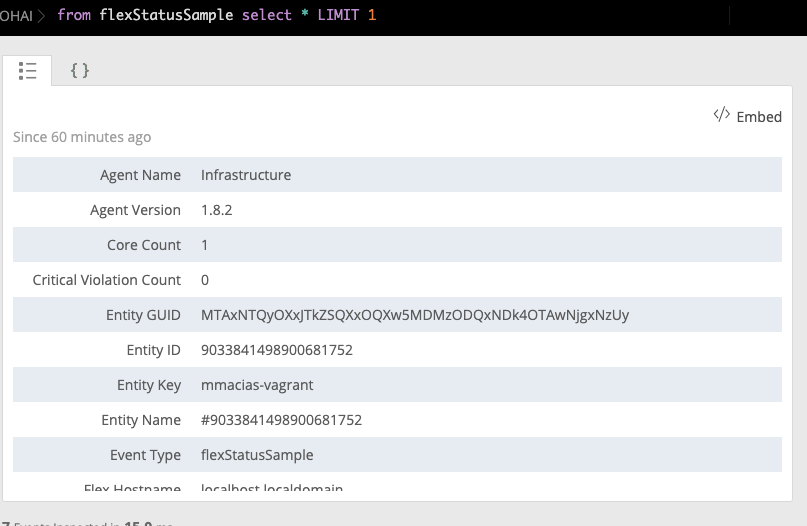
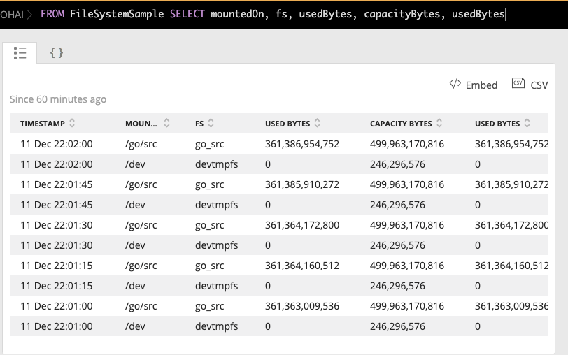

# Flex step-by-step tutorial

Follow this tutorial to get started with Flex!

## Requirements

Before starting this tutorial, make sure that you meet the following requirements: 

* [Infrastructure agent](https://docs.newrelic.com/docs/infrastructure/install-configure-manage-infrastructure) version 1.10.7 or higher installed, which bundles Flex by default.
* Infrastructure agent running in [root/administrator mode](https://docs.newrelic.com/docs/infrastructure/install-configure-infrastructure/linux-installation/linux-agent-running-modes). 

## Installation

Starting from New Relic Infrastructure agent version 1.10.7, Flex comes bundled with the agent, so you don't need to perform any extra step.

## Check that Flex is up and running

1. Create a file named `my-flex-configs.yml` (or similar) in this folder:
    * Linux: `/etc/newrelic-infra/integrations.d`
    * Windows: `C:\Program Files\New Relic\newrelic-infra\integrations.d`
2. Edit the file and add the following snippet:
   ```yaml
   integrations:
     - name: nri-flex
       config:
         name: just-testing
   ```
3. Go to New Relic and run the following [NRQL query](https://docs.newrelic.com/docs/query-data/nrql-new-relic-query-language):

```sql 
FROM flexStatusSample SELECT * LIMIT 1
```

The query should produce a table similar to this:



### What happened behind the scenes

1. The Infrastructure agent detects that a new integration, `nri-flex`, has been added.
2. The agent looks for an executable named `nri-flex` in `/var/db/newrelic-infra/newrelic-integrations/`.
3. A temporary configuration file is created with this content:
   ```yaml
   name: just-testing
   ```
4. `nri-flex` is executed and gets the path of the config file via the `CONFIG_PATH` environment variable.
5. Flex recognizes a configuration named `just-testing`, but since it does not provide extra information it just returns a `flexStatusSample` containing the internal status of the Flex integration.

## Your first Flex integration

This example shows how to collect disk metrics from file systems not natively supported by New Relic using the `df` command in Linux. A similar result could be achieved in Windows with a few changes.

The goal of Flex is to process the output of the `df` command, showing the file system and 1-byte blocks, while excluding file systems already supported by the agent. If unsupported file systems are not mounted, remove the `-x` arguments.

```bash
$ df -PT -B1 -x tmpfs -x xfs -x vxfs -x btrfs -x ext -x ext2 -x ext3 -x ext4
Filesystem     Type         1-blocks         Used    Available Capacity Mounted on
devtmpfs       devtmpfs    246296576            0    246296576       0% /dev
go_src         vboxsf   499963170816 361339486208 138623684608      73% /go/src
``` 

We want Flex to convert the above tabular text output into a set of equivalent JSON samples with the following format. Notice that the agent decorates each sample with extra fields:

```json
{
  "event": {
    "event_type": "FileSystemSample",
    "fs": "go_src",
    "fsType": "vboxsf",
    "capacityBytes": 499963170816,
    "usedBytes": 361345331200,
    "availableBytes": 138617839616,
    "usedPerc": 73,
    "mountedOn": "/go/src"
  }
}
```

First, you need to tell Flex how to perform the above "table text to JSON" transformation by specifying the following:

- Name of the metric: `FileSystem`
- Which command to run: `df -PT -B1 ...`
- How to split the output table from `df`
- How to assign the values to given metric names

This is achieved by placing the content below in the YAML configuration file:

```yaml
integrations:
  - name: nri-flex
    config:
      name: linuxFileSystemIntegration
      apis:
        - name: FileSystem
          commands:
            - run: 'df -PT -B1 -x tmpfs -x xfs -x vxfs -x btrfs -x ext -x ext2 -x ext3 -x ext4'
              split: horizontal
              split_by: \s+
              set_header: [fs,fsType,capacityBytes,usedBytes,availableBytes,usedPerc,mountedOn]
          perc_to_decimal: true
```

- The `apis` section is an array of entries for each sample. Each entry sets a name for the sample, as well as the commands/procedures to get and process the sample.
- The first entry in `apis` is named `FileSystem`: it is used to build the `FileSystemSample` event name.
- In the `commands` section, we specify how to get the information:
    - `run: 'df -PT -B1...` specifies the command to run.
    - `split: horizontal` states that each output line may return a metric.
    - `split_by` explains how to split each line in different fields. In this case, we use the `\s+` regular expression, which tells Flex that any sequence of one or more white spaces is a separator.
    - `set_header` specifies, in order, a matching name for each value of the aforementioned array.
    - `perc_to_decimal: true` indicates to convert any percentage string into a decimal value, removing the trailing `%` symbol.

**Once the Flex config is created, the Infrastructure agent autodetects the new config and begins collecting data.**

To check that your new integration is working, execute the following [NRQL query](https://docs.newrelic.com/docs/query-data/nrql-new-relic-query-language):

```sql
FROM FileSystemSample SELECT mountedOn, fs, usedBytes, capacityBytes, usedBytes
```

The query should now produce a table similar to this:



## For more examples

Check the [Flex configs examples](../examples/flexConfigs) folder for more working examples of Flex.
