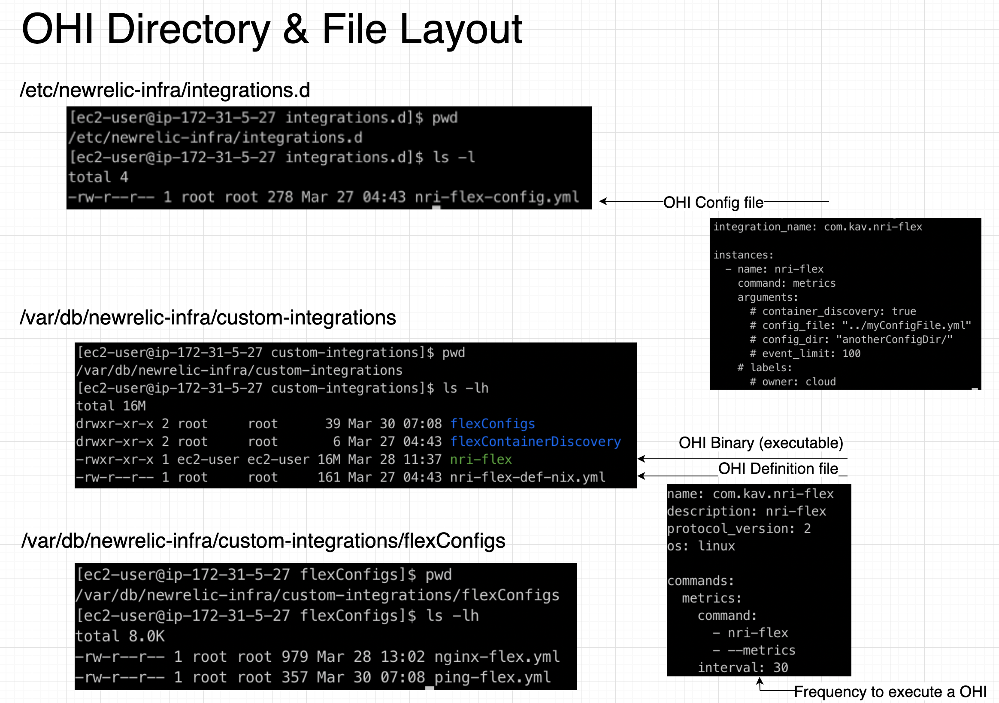

### OHI Layout

* When using Flex with the New Relic Infrastructure Agent, this is the file / directory structure that should appear for Linux.

* Within the OHI Config File, we could spawn multiple instances of Flex with different configurations if needed.

