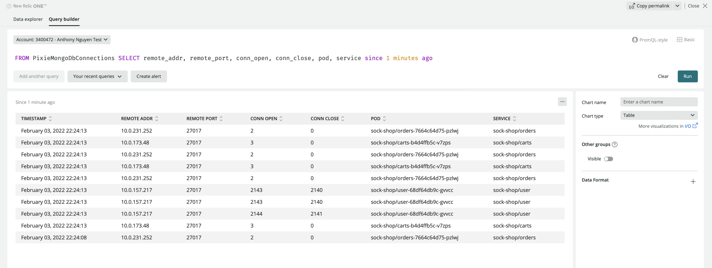

# Collect custom Pixie metrics from your k8s cluster and push to New Relic for Alerting and Dashboarding

The following documentation explains how to configure the New Relic FLEX integration to collect custom Pixie metrics from your k8s cluster.

Currently, for security reasons, when [Pixie](https://pixielabs.ai) is installed into your k8s cluster, New Relic only fetches and stores data that related to an application's performance. Therefore, you can only create Alert and Dashboard on a predefined subset of the data collected by Pixie [read more here](https://docs.newrelic.com/docs/kubernetes-pixie/auto-telemetry-pixie/pixie-data-security-overview/).

The persisted performance metrics include, but are not limited to:

-   Golden metrics (throughput, latency, error rate) for HTTP-based services
-   HTTP transaction data
-   Database transaction data (for MySQL & PostgreSQL)
-   Distributed tracing
-   JVM metrics

With New Relic Flex, you now can report and alert on all other available Pixie metrics by:

-   write custom [Pixie script](https://docs.pixielabs.ai/tutorials/pxl-scripts/write-pxl-scripts/)
-   use New Relic Flex to push the Pixie query result to NRDB as custom metrics
-   then create dashboard or alerts based on collected metrics

## Step 1: create custom New Relic Infrastructure docker image with Pixie CLI installed

-   build new docker image using the following Docker file

```Dockerfile
FROM newrelic/infrastructure:latest

WORKDIR /usr/local/bin

COPY install-pixie-no-auth-docker.sh .

RUN chmod +x ./install-pixie-no-auth-docker.sh

RUN ./install-pixie-no-auth-docker.sh

RUN px version
```

-   push the docker image to your docker registry

## Step 2: Configure required Pixie secrets

```bash
# create file containging New Relic ingest API key
echo -n 'YOUR_NR_API_KEY' > nringestapi

# create file containging PIXIE API key
# you can get this by click on `Copy command` link under `Live debugging with Pixie` tab on New Relic Kubernetes Cluster Explorer page
echo -n 'YOUR_NR_API_KEY' > pixieapikey

# assuming your kubectl config file is at default location: $HOME/.kube/config
kubectl create secret generic pixiesecrets --from-file=./pixiesecrets/pixieapikey --from-file=$HOME/.kube/config --from-file=./pixiesecrets/nringestapi
```

## Step 3: Run New Relic infrastructure agent in your k8s cluster

-   deploy the following resource to your k8s cluster, replace the following
    -   `YOUR_NEW_RELIC_INFRASTRUCTURE_IMAGE_NAME`: name of Docker image which you pushed to the Docker Registry
    -   `CUSTOM_EVENT_TYPE_NAME`: custom envent table name (e.g. PixieMongoDbConnections)
-   in this particular example, we extract MongoDB connections (port 27017) from `conn_stats` table, hence the value of `set_header` attribute

```yaml
apiVersion: apps/v1
kind: DaemonSet
metadata:
    name: nri-flex
    namespace: default
    labels:
        name: nri-flex
spec:
    selector:
        matchLabels:
            name: nri-flex
    updateStrategy:
        type: RollingUpdate
    template:
        metadata:
            labels:
                name: nri-flex
        spec:
            hostNetwork: true
            hostPID: true
            containers:
                - name: nri-flex
                  image: YOUR_NEW_RELIC_INFRASTRUCTURE_IMAGE_NAME
                  imagePullPolicy: Always
                  env:
                      - name: NRIA_DISPLAY_NAME
                        valueFrom:
                            fieldRef:
                                apiVersion: 'v1'
                                fieldPath: 'spec.nodeName'
                      - name: NRK8S_NODE_NAME
                        valueFrom:
                            fieldRef:
                                apiVersion: 'v1'
                                fieldPath: 'spec.nodeName'
                      - name: NRIA_LICENSE_KEY
                        valueFrom:
                            secretKeyRef:
                                name: pixiesecrets
                                key: nringestapi
                  volumeMounts:
                      - mountPath: /host
                        name: host-volume
                        readOnly: true
                      - mountPath: /kubeconfig
                        name: kubeconfig
                      - mountPath: /var/run/docker.sock
                        name: host-docker-socket
                      - mountPath: /etc/newrelic-infra/integrations.d/
                        name: nri-integration-cfg-volume
                      - mountPath: /custom-scripts
                        name: custom-scripts
                        readOnly: true
                  resources:
                      limits:
                          memory: 300M
                      requests:
                          cpu: 100m
                          memory: 100M
            volumes:
                - name: host-volume
                  hostPath:
                      path: /
                - name: host-docker-socket
                  hostPath:
                      path: /var/run/docker.sock
                - name: nri-default-integration-cfg-volume
                  configMap:
                      name: nri-default-integration-cfg
                - name: nri-integration-cfg-volume
                  configMap:
                      name: nri-integration-cfg
                - name: custom-scripts
                  configMap:
                      name: custom-scripts
                - name: kubeconfig
                  secret:
                      secretName: pixiesecrets
---
apiVersion: v1
kind: ConfigMap
metadata:
    name: nri-integration-cfg
    namespace: default
data:
    nri-flex.yml: |
        integrations:
          - name: nri-flex
            config:
              name: example
              apis:
                - event_type: PixieMongoDbConnections
                  commands:
                    - run: export PX_API=$(cat /kubeconfig/pixieapikey) && px auth login --api_key=$PX_API --kubeconfig /kubeconfig/config && px run -f /custom-scripts/mongo-db-connections.pxl --kubeconfig /kubeconfig/config -o csv
                      split: horizontal
                      set_header: [tableid, remote_addr, remote_port, conn_open, conn_close, pod, service]
                      row_start: 4
                      split_by: \,
---
apiVersion: v1
kind: ConfigMap
metadata:
    name: custom-scripts
    namespace: default
data:
    mongo-db-connections.pxl: |
        import px

        df = px.DataFrame(table='conn_stats', start_time='-30s')

        df = df[['remote_addr','remote_port','conn_open', 'conn_close']]

        df.pod = df.ctx['pod']
        df.service = df.ctx['service']

        df = df[df['remote_port'] == 27017]

        px.display(df)
```

-   after couple minutes, you can query the data in New Relic like this

